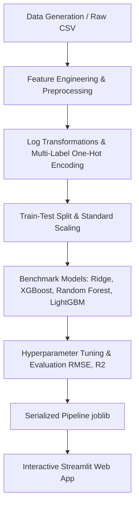

# Movie Rating Prediction - Machine Learning Regression

An end-to-end Machine Learning Regression project that predicts movie ratings (IMDb/TMDB style 1.0 to 10.0 continuous scale) based on movie metadata such as budget, expected box office revenue, runtime, release year, multi-label genres, lead actors, and directors.

Includes a complete data preprocessing pipeline, multi-model benchmark evaluation, hyperparameter tuning, model serialization, and an interactive Streamlit Web Application.

---

## 🌐 Live Web Application
Visit the deployed application on Streamlit Community Cloud:  
👉 **[https://movie-rating-prediction-aiacrkhcysfurgjbld5ig9.streamlit.app/](https://movie-rating-prediction-aiacrkhcysfurgjbld5ig9.streamlit.app/)**

---

## Project Architecture & Workflow



---

## Features & Highlights

- **Multi-Label Genre One-Hot Encoding**: Efficiently handles multi-genre combinations (e.g. `Action|Sci-Fi|Thriller`).
- **Financial Feature Engineering**: Logarithmic scaling (`log1p`) for skewed budget/revenue values and automated Box Office ROI multiplier computation.
- **Star Power Encoding**: Bayesian smoothed target encoding for actors and directors to quantify historical rating impact without overfitting.
- **Algorithm Benchmarking**: Evaluates Linear/Ridge Regression, Random Forest, Gradient Boosting, XGBoost, and LightGBM.
- **Interactive Web UI**: Streamlit application featuring live predictions, rating classification badges (Blockbuster, Good, Average, Flop), and interactive dataset analytics.

---

## Model Evaluation Summary

Models were evaluated on a 2,500 record dataset split into 80% training and 20% testing:

| Model | RMSE | MAE | $R^2$ Score |
| :--- | :---: | :---: | :---: |
| **Ridge Regression (Best)** | **0.5993** | **0.4837** | **0.5136** |
| **XGBoost Regressor** | 0.6009 | 0.4848 | 0.5111 |
| **Gradient Boosting** | 0.6032 | 0.4836 | 0.5072 |
| **LightGBM Regressor** | 0.6071 | 0.4863 | 0.5009 |
| **Random Forest** | 0.6087 | 0.4812 | 0.4982 |

---

## Directory Structure

```text
Ml project/
├── data/
│   ├── movies.csv             # Generated training dataset (2,500 records)
│   └── .gitkeep
├── models/
│   ├── movie_rating_model.joblib  # Serialized scikit-learn pipeline
│   ├── metrics.json           # Model evaluation results
│   └── .gitkeep
├── src/
│   ├── generate_dataset.py    # Dataset creation script
│   ├── preprocessing.py       # Custom feature transformer
│   ├── train.py               # Model training & benchmarking pipeline
│   └── predict.py             # Inference API & CLI prediction
├── app.py                     # Streamlit web application
├── requirements.txt           # Dependency requirements
├── .gitignore                 # Git ignore rules
└── README.md                  # Project documentation
```

---

## Quick Start & Local Setup

### 1. Prerequisites
Ensure you have **Python 3.10+** installed on your system.

### 2. Clone Repository & Setup Virtual Environment
```bash
# Navigate to project root directory
cd "Ml project"

# Create a virtual environment
python -m venv .venv

# Activate virtual environment
# Windows (PowerShell):
.\.venv\Scripts\Activate.ps1
# Windows (CMD):
.\.venv\Scripts\activate.bat
# Linux/macOS:
source .venv/bin/activate
```

### 3. Install Dependencies
```bash
pip install -r requirements.txt
```

---

## Running the Project

### Launch the Streamlit Web Application
```bash
streamlit run app.py
```

### Run Terminal Prediction (CLI)
```bash
python src/predict.py
```

### Re-Train Models & Generate Dataset
```bash
python src/train.py
```

---

## License
This project is open-source and available under the MIT License.
